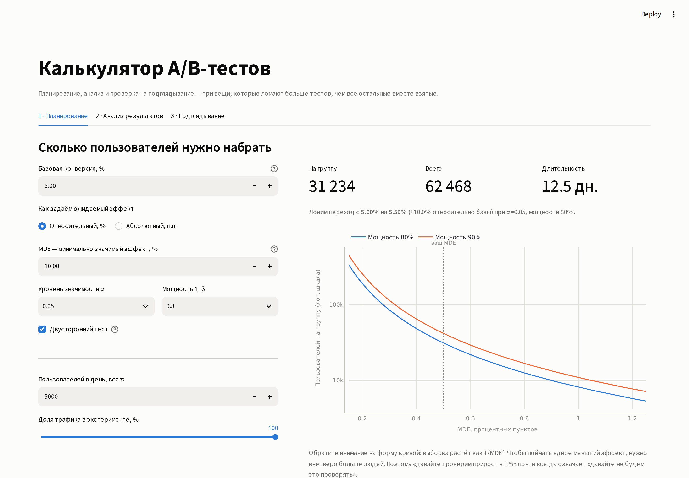
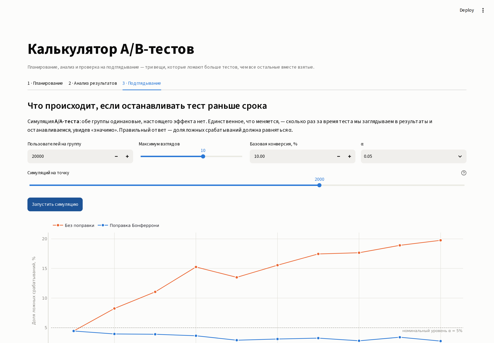

# Калькулятор A/B-тестов

Интерактивный инструмент для планирования и анализа A/B-тестов: расчёт размера
выборки, проверка значимости результата и симуляция, показывающая, во что
обходится подглядывание в дашборд до окончания теста.

**- [Открыть приложение](ВСТАВИТЬ_ССЫЛКУ_ПОСЛЕ_ДЕПЛОЯ)** &nbsp;·&nbsp;
**- [Разбор математики в ноутбуке](./ab_testing.ipynb)**



---

## Цель
A/B тестам свойственны следующие проблемы: нелостаточная выборка которачя ведет к неверным выводам. Порой тест может показать что эффекта нет, тогда как на самом деле не всего на всего не хватило выборки. Также часто происходит так называемый peeking который может исказить результаты теста. Цель данного проекта сможелировать такие ситуации и показать как их можно избежать. 


## Что внутри

### 1  Планирование

Расчёт размера выборки на группу по базовой конверсии, MDE, уровню значимости
и мощности. Показывает длительность теста при заданном трафике и кривую
«размер выборки  MDE» для мощности 80% и 90%.

Предупреждает о двух практических проблемах: тест длиннее месяца (за такой срок
меняются и аудитория, и продукт) и тест короче недели (захватывает не все дни
недельного цикла).

### 2  Анализ результатов

Ввод вручную или загрузка CSV. Тип теста выбирается автоматически:

* метрика из нулей и единиц - **z-тест двух долей**;
* непрерывная метрика - **тест Уэлча** 

Выдаёт эффект в абсолютных и относительных величинах, доверительные интервалы,
p-value и - если результат незначим - **минимальный эффект, который тест вообще
был способен поймать** при такой выборке. Это и есть ответ на вопрос
«эффекта нет или данных не хватило».

### 3 · Подглядывание

Симуляция A/A-теста: обе группы получают одинаковый опыт, настоящего эффекта
нет по построению. Меняется только число взглядов в результаты. График
показывает, как растёт доля ложных срабатываний, и что с ней делает поправка
на множественные сравнения.



Десять взглядов вместо одного поднимают частоту ложных выводов с 5% примерно
до 19% — то есть почти каждый пятый «выигравший» тест на самом деле ничего
не выиграл.

## Формат CSV

Две колонки: группа (ровно два значения) и метрика.

```csv
user_id,group,converted
1,A,0
2,A,1
3,B,0
```

Готовые примеры лежат в `data/`: `sample_conversion.csv` (бинарная метрика)
и `sample_revenue.csv` (средний чек).

## Корректность расчётов

Собственные формулы бесполезны, пока не сошлись с эталонными. Всё сверено в
[ноутбуке](./ab_testing.ipynb):

| Что | С чем сверено | Результат |
|---|---|---|
| Размер выборки | `statsmodels.stats.power.NormalIndPower` | расхождение < 0,2% |
| z-статистика и p-value | `statsmodels.stats.proportion.proportions_ztest` | совпадение до 6-го знака |
| Доверительный интервал разницы долей | `confint_proportions_2indep` | совпадение до 6-го знака |
| Тест Уэлча | `scipy.stats.ttest_ind(equal_var=False)` | совпадение до 6-го знака |
| Интервал для средних | бутстрап, 2000 пересэмплов | совпадение в пределах шума |
| Распределение p-value под H₀ | симуляция, 5000 тестов | равномерное, доля p < 0,05 равна 5% |

Расхождение в размере выборки не является ошибкой: `statsmodels` параметризует
задачу через размер эффекта Коэна (арксинус-преобразование), здесь используется
формула с объединённой дисперсией под H₀. Это два разных приближения одной
величины.

## Запуск локально

```bash
git clone https://github.com/afzalsgtv/ab-test-calculator.git
cd ab-test-calculator
pip install -r requirements.txt
streamlit run app.py
```

Ноутбук с разбором математики:

```bash
jupyter lab ab_testing.ipynb
```

## Структура

```
├── app.py               # интерфейс Streamlit, три вкладки
├── ab_core.py           # статистическое ядро — формулы отдельно от интерфейса
├── ab_testing.ipynb     # разбор математики и сверка с statsmodels / scipy
├── data/                # примеры CSV для загрузки
├── requirements.txt
└── .streamlit/config.toml
```

Статистика вынесена из `app.py` в `ab_core.py` намеренно: формулы так можно
тестировать и переиспользовать без запуска интерфейса, а ноутбук импортирует
ровно тот же код, который работает в приложении.

## Ограничения

Вещи, которые приложение сознательно не делает, — их стоит знать до того, как
применять результат к реальному тесту:

* **Нормальное приближение.** При `n · p < 10` (редкие события на малых
  выборках) оно перестаёт работать — нужен точный тест Фишера.
* **Одна метрика за раз.** Проверка десяти метрик подряд — это та же проблема
  множественных сравнений, что и подглядывание, и здесь она не корректируется.
* **Нет поправок на дисперсию.** CUPED и винзоризация выбросов заметно
  сокращают требуемую выборку для денежных метрик, но не реализованы.
* **Нет последовательного дизайна.** Поправка Бонферрони во вкладке
  «Подглядывание» приведена как иллюстрация механики, а не как рекомендация;
  на практике используют границы О'Брайена — Флеминга или confidence sequences.
* **Случайное распределение предполагается корректным.** Перекос в сплите
  (SRM) не проверяется, хотя это первое, что нужно смотреть в реальном тесте.


## Использование ИИ

Проект сделан с помощью ИИ-ассистента (Claude). 
**Моя часть:** постановка задачи, выбор статистических методов, проверка
формул  и сверка с `statsmodels` / `scipy` в ноутбуке, ревью
и доработка кода, выбор того, что показывать в интерфейсе.

**Часть ИИ:** написание и рефакторинг кода интерфейса, генерация демо-данных,
оформление графиков, черновики текстов.
